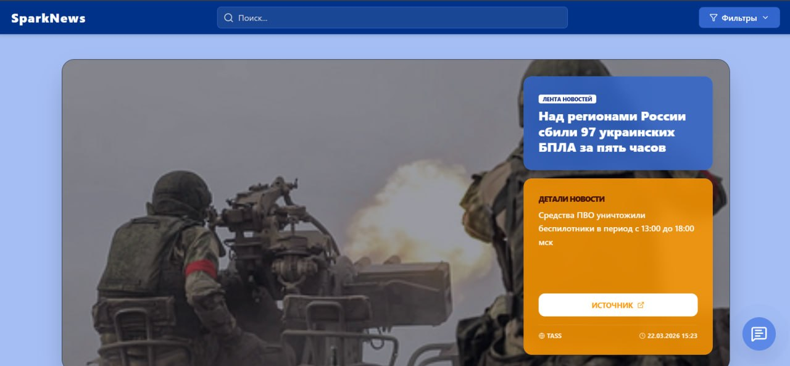
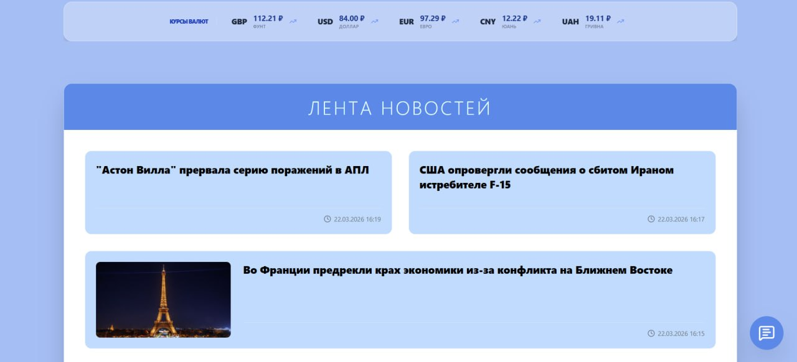
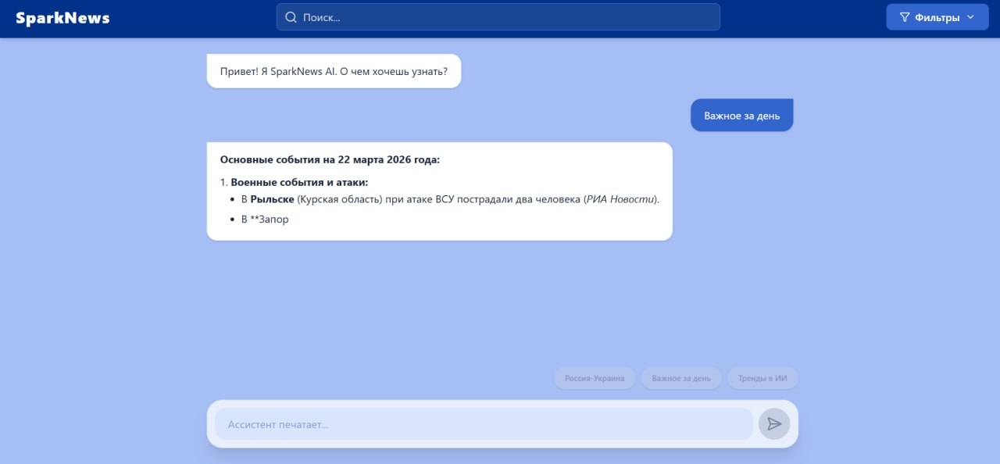
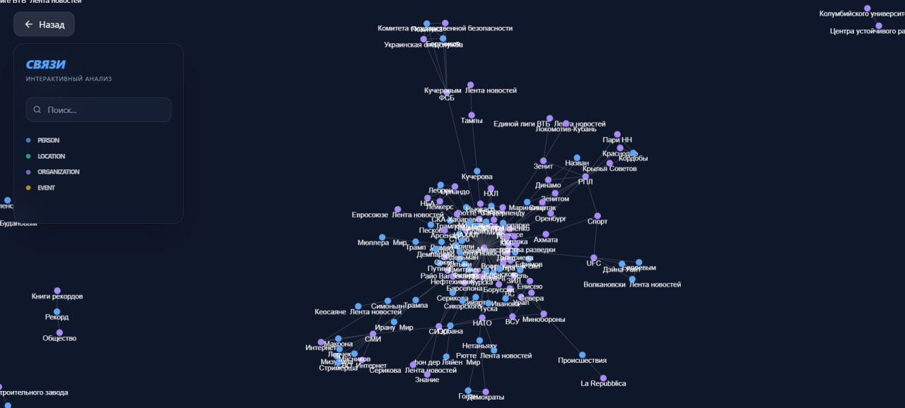

# 🍪 Spark News

### Интеллектуальная платформа агрегации,  кластеризации и  анализа новостей

ДГТУ Хакатон Весна 2026

---

### 🍪 О проекте
Spark News — это интеллектуальная система, которая превращает поток разрозненных новостей в структурированное.

Платформа:
- агрегирует новости из разных источников
- понимает их смысл (NLP)
- объединяет в тематические кластеры
- строит граф связей между людьми, организациями и событиями
- отвечает на вопросы пользователя через RAG

👉 Вместо поиска по ключевым словам — поиск по смыслу и связям

---

###  [⚙️ Backend:](https://github.com/yaroniks/Cookie2026/tree/backend)
### 🧠 Стек
- FastAPI — API
- PostgreSQL + pgvector — векторное хранилище
- Neo4j — knowledge graph
- Redis — кэш
- spaCy — NLP
- SentenceTransformers — embeddings
- HDBSCAN — кластеризация
- APScheduler — фоновые задачи
- Pydantic — валидация

### 🔄 Pipeline обработки
1. Сбор данных
    - RSS, API новостных порталов
2. Извлечение знаний
    - NER (Person, Organization, Location)
    - Relation Extraction
3. Семантическое представление
    - SentenceTransformers (SBERT / MiniLM)
4. Кластеризация
    - HDBSCAN / K-Means
5. Хранение
    - PostgreSQL + pgvector → поиск
    - Neo4j → граф связей
6. RAG
    - генерация ответов через Mistral
    - использование контекста из базы

> by yarovich

---

### [🎨 Frontend:](https://github.com/yaroniks/Cookie2026/tree/Frontend)
### ✨ Стек
- React + Vite — сверхбыстрая сборка и современная библиотека интерфейсов
- TypeScript — строгая типизация для надежности кода
- TailwindCSS — утилитарный фреймворк для адаптивного и современного дизайна
- React Force Graph 2D — визуализация графа связей на базе Canvas/WebGL
- Lucide React — набор консистентных и легких иконок
- Axios — клиент для работы с API и стриминговыми запросами
- React Markdown — рендеринг ответов ИИ с поддержкой форматирования

> by RanVix

---

### 📸 Скриншоты
|  |  |
| :--: | :--: |
|  |  |

[GNU AGPL v3 License](./LICENSE) 
**© 2026 Cookie**  

